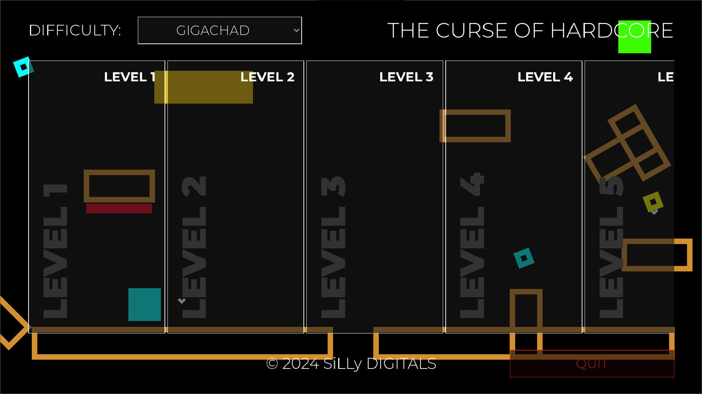

# The Curse of Hardcore 
Это захватывающий платформер с минималистичной графикой, который погружает игроков в мир полный испытаний и приключений. В этой игре вам придется преодолевать множество препятствий, используя свои навыки и интуицию, чтобы пройти каждый уровень. С каждым новым уровнем сложность увеличивается, предлагая игрокам непрерывный поток вызовов. Несмотря на минималистичный вид и простой геймплей, "Проклятие Хардкора" будет держать вас в напряжении на протяжении всей игры. Готовьтесь к незабываемому приключению с "Проклятием Хардкора"!

## Уровни и их сложность
Уровни и их сложность не имеют никакого отношения к их нумерации. Например, уровни 2 и 3 более сложные, чем уровни 4 и 5 🙃. Если вам сложно пройти определенный уровень, пропустите его и перейдите к следующему уровню. Простите, что уровни 2 и 3 оказались очень сложными и "пустыми" 😅. Обещаю, что следующие уровни будут более интересными.

## Следите за развитием игры на Trello
Вы можете отслеживать развитие проекта на Trello в любое время и комментировать их 😊. Однако, если вы не знаете русский язык, вам будет трудно понять, что там написано (Google Переводчик может вам помочь 🙃). Ссылка на доску проекта в Trello: 

[The Curse of Hardcore Trello](https://trello.com/b/pCdhUOOy/the-curse-of-hardcore)

